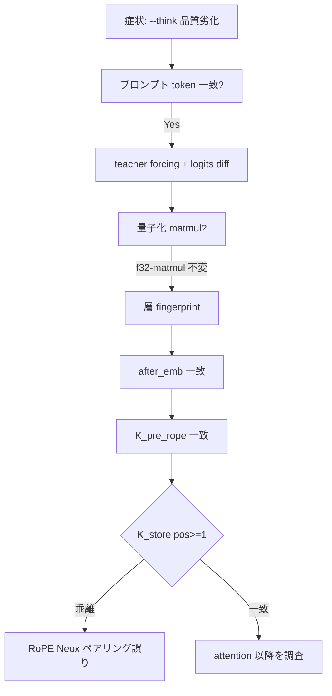

# 設計仕様書

> **注意**: 本ドキュメントは設計仕様書です。変更履歴や実装の詳細な変更点については、`ChangeLog.md` を参照してください。本ドキュメントでは、現在のシステムの設計と仕様を記述します。

## 概要

Gemma4.c は **Gemma 4 E4B**（主に `gemma-4-E4B-it-Q4_K_M.gguf`）を **C 言語**で推論するためのリポジトリです。PyTorch 等の ML ランタイムには依存せず、GGUF の mmap 読み取り・トークナイズ・Transformer フォワード・サンプリングを単一ソースに集約しています。

主な機能:

- **単発推論**: 1 プロンプトに対する応答生成
- **マルチターン対話** (`-i`): stdin から複数ターンのチャット、会話履歴の再エンコード
- **Thinking モード** (`--think`): Gemma 4 の `<|think|>` / `<|channel>` 形式による推論トレース生成

| 項目 | 内容 |
|------|------|
| 実装 | `gemma4-4b/cpu-blas/` |
| 依存 | C11、OpenBLAS、OpenMP（`libgomp`）、`libm` |
| 用途 | マルチスレッド GEMV・Q8_K 内積による CPU 推論 |

デコーダは ISWA、共有 KV、PLE、タイド LM ヘッド、logit softcapping を実装する。単発推論・対話・Thinking モードを同一 CLI で提供する。

大容量の GGUF モデルファイルは Git 管理外とし、リポジトリには取得手順・整合性検証用チェックサム・上記 CPU 推論実装を含めます。

**クイックスタート**はルートの [`README.md`](../README.md)。本ドキュメントはフルスクラッチ実装・llama.cpp 数値突合用の**規範仕様**です。

### 本ドキュメントの構成（フルスクラッチ実装者向け）

| 節 | 内容 |
|----|------|
| §アーキテクチャ | E4B ハイパーパラメータ概要 |
| §**Attention と RoPE** | **Neox RoPE 規範・バグ再発防止（必読）** |
| §KV キャッシュ | レイアウト・共有 KV・SWA 窓 |
| §完全なデコーダ 1 層仕様 | Attention→FFN→PLE の厳密順序 |
| §テンソル形状一覧 | 重み行列 out×in |
| §ISWA 層マップ | 全 42 層の SWA/Full/KV 参照 |
| §PLE / §FFN | 補助 embedding・FFN 数式 |
| §推論ループ | Prefill/decode・lm_mode |
| §行列レイアウト | GEMV・量子化 matmul |
| §数値検証・回帰テスト | llama.cpp 突合手順 |
| §トークナイザー / Thinking | チャット template・状態機械・**`--think` 有無による難易度差** |
| §フルスクラッチ実装アンチパターン | 12 項目 checklist |
| `ChangeLog.md` | バグ調査経緯（RoPE 事例） |

---

```
Gemma4.c/
├── README.md            # リポジトリ概要・クイックスタート（本 design.md への導線）
├── LICENSE              # Apache License 2.0
├── .gitignore           # Git 管理外ファイルの定義
├── tmp/                 # 調査・比較用一時ファイル（Git 管理外）
├── doc/
│   ├── design.md        # 本ドキュメント（設計仕様書）
│   └── ChangeLog.md     # 変更履歴
├── tools/               # llama.cpp 比較用ユーティリティ（C++）
│   ├── llama_dump_gen.cpp         # greedy 生成 token ID ダンプ
│   ├── llama_dump_logits.cpp      # logits / hidden ダンプ
│   ├── llama_dump_layer_hidden.cpp # eval-callback による層出力ダンプ
│   └── compare_vec_dot.cpp        # Q4_K×Q8_K 内積の ggml 比較
└── gemma4-4b/
    ├── Makefile         # `make model` によるダウンロード・検証
    ├── gguf.txt         # モデル配布 URL（Hugging Face）
    ├── gemma-4-E4B-it-Q4_K_M.gguf.sha256sum  # SHA256 チェックサム（Git 管理）
    ├── gemma-4-E4B-it-Q4_K_M.gguf            # モデル本体（Git 管理外）
    └── cpu-blas/
        ├── main.c       # OpenBLAS + OpenMP 推論エンジン
        └── Makefile     # `make build` / `make run` / `make openblas`
```

## Git 管理方針

| ファイル | Git 管理 | 備考 |
|----------|----------|------|
| `README.md` | 内 | リポジトリ概要・ビルド手順・doc への導線 |
| `gemma4-4b/gemma-4-E4B-it-Q4_K_M.gguf` | 外 | `.gitignore` で除外。ローカルに `make model` で取得 |
| `gemma4-4b/gemma-4-E4B-it-Q4_K_M.gguf.sha256sum` | 内 | ダウンロード後の整合性検証に使用 |
| `gemma4-4b/gguf.txt` | 内 | ダウンロード元 URL |
| `gemma4-4b/Makefile` | 内 | モデル取得ターゲット |
| `gemma4-4b/cpu-blas/main.c` | 内 | CPU 推論実装 |
| `gemma4-4b/cpu-blas/Makefile` | 内 | ビルド・実行・依存インストール |
| `gemma4-4b/cpu-blas/gemma4-cpu-blas` | 外 | ビルド生成物 |
| `tools/*.cpp` | 内 | llama.cpp 比較用ツール（要 llama.cpp ビルド環境） |
| `tmp/*` | 外 | 調査・比較用の一時ファイル（llama.cpp クローン等） |

`.gitignore` の該当エントリ:

```
gemma4-4b/gemma-4-E4B-it-Q4_K_M.gguf
gemma4-4b/cpu-blas/gemma4-cpu-blas
tmp/*
```

## モデル取得（gemma4-4b）

### 対象モデル

- **ファイル名**: `gemma-4-E4B-it-Q4_K_M.gguf`
- **量子化**: Q4_K_M（線形層は Q4_K / Q5_K / Q6_K、PLE 投影は BF16、norm 等は F32 が混在）
- **配布元**: [unsloth/gemma-4-E4B-it-GGUF](https://huggingface.co/unsloth/gemma-4-E4B-it-GGUF)（URL は `gguf.txt` に記載）
- **チェックサム**: `gemma-4-E4B-it-Q4_K_M.gguf.sha256sum` に Q4_K_M（推論デフォルト）ほか、同一配布の別量子化（例: Q8_0）の行を併記可能

### 取得手順

```bash
cd gemma4-4b
make model
```

### `make model` の動作

1. `gemma-4-E4B-it-Q4_K_M.gguf.sha256sum` の存在を確認する。
2. モデルファイルが既に存在し、チェックサムが一致する場合はダウンロードをスキップする。
3. 存在しない、またはチェックサム不一致の場合、`gguf.txt` の URL（`/blob/main/` を `/resolve/main/` に変換）から `wget` でダウンロードする。
4. ダウンロード後、`sha256sum --check` で整合性を検証する。
5. 検証失敗時は破損ファイルを削除し、再実行を促す。

### Makefile 変数

| 変数 | デフォルト | 説明 |
|------|------------|------|
| `MODEL` | `gemma-4-E4B-it-Q4_K_M.gguf` | 取得・検証対象のモデルファイル名 |

## CPU 推論（gemma4-4b/cpu-blas）

### 実装概要

| 項目 | 内容 |
|------|------|
| ソース | `gemma4-4b/cpu-blas/main.c` |
| ビルド | `make build` → 実行ファイル `gemma4-cpu-blas` |
| 実行 | `make run` または `./gemma4-cpu-blas <model.gguf> [options]` |
| 依存 | C11、`libopenblas`、`libgomp`（OpenMP） |
| 並列 | OpenMP（`OMP_NUM_THREADS`）。OpenBLAS は `openblas_set_num_threads(1)` で単スレッド固定し、二重並列を避ける |

GGUF を `mmap` で読み込み、量子化重み（Q4_K / Q5_K / Q6_K）は **`QK_K=256` ブロック単位**で逆量子化しながら GEMV する。全重みの float 一括展開は行わない。起動時に OpenMP 最大スレッド数を表示する。

### 最適化の要点

- **F32 行列**: 行帯を OpenMP で分割し、帯ごとに `cblas_sgemv`（NoTrans）
- **Attention**: ヘッド単位で K 内積・V 合成を `cblas_sgemv` に集約（SWA 窓・共有 KV 対応）
- **Q4_K / Q5_K**: 活性化を Q8_K 化し整数内積（行全体のフル逆量子化を回避）。AVX2 時は SIMD 経路あり
- **Q6_K / BF16**: OpenMP 並列 GEMV（ブロック逆量子化または F16/BF16 dot）
- **数値**: `-ffast-math` は使用しない（Q8_K 内積・RMSNorm が崩れるため）
- **デバッグ**: `-DGEMMA4_USE_GENERIC_DOT` で AVX2 内積を generic 実装に切替可能（SIMD バグ切り分け用）。`--f32-matmul` で Q4_K / Q5_K 重みを F32 dequant 後 matmul に切替可能（量子化 matmul 切り分け用、低速）

### 実行モード

| モード | 起動方法 | 説明 |
|--------|----------|------|
| 単発（既定） | オプションなし | `-p` のプロンプト 1 回分をエンコードし、応答を生成して終了 |
| 対話 | `-i` / `--interactive` | stdin から複数ターンのチャット。`/quit` または `/exit` で終了。`-p` が指定されていれば最初のユーザーメッセージとして使用 |

対話モードではターンごとに会話履歴を再エンコードする。履歴は最大 **128 ターン**（`MAX_CHAT_TURNS`）、プロンプト全体は最大 **8192 トークン**（`MAX_PROMPT_TOKS`）、1 行の入力は最大 **4096 バイト**（`MAX_LINE`）。

### コマンドラインオプション

| オプション | 既定値 | 説明 |
|------------|--------|------|
| `-p <prompt>` | `Hello, how are you?` | ユーザープロンプト（単発モードの入力、または対話モードの初回メッセージ） |
| `-n <tokens>` | `256` | ターンあたりの最大生成トークン数（内部上限 `MAX_GEN_TOKS=4096`） |
| `-t <temp>` | `0.6` | サンプリング温度（`0` で greedy） |
| `-k <topp>` | `0.9` | Top-p サンプリング |
| `-r <penalty>` | `1.0` | Repetition penalty（llama.cpp 互換。`-r 1.1` 等で有効化） |
| `-N <n>` | `64` | Repetition penalty の対象ウィンドウ（`0` = 全生成トークン） |
| `-s <seed>` | 時刻 | 乱数シード |
| `-l <len>` | `8192` | 最大シーケンス長（KV キャッシュ上限） |
| `-i` / `--interactive` | オフ | 対話型マルチターン モード |
| `--think` | オフ | Thinking モード（推論トレースを生成。既定では回答のみ表示） |
| `--show-thinking` | オフ | Thinking トレースを stderr に表示（`--think` を暗黙的に有効化） |
| `--thinking-budget <n>` | `--think` 時 **256** | thinking トークン上限。超過時に `<channel|>` を強制挿入（`-1` = 無制限） |
| `--dump-prompt` | オフ | エンコード後のプロンプト token ID を stderr に出力（デバッグ用） |
| `--dump-gen` | オフ | 生成 token ID を stderr に出力（デバッグ用） |
| `--force-gen <ids>` | オフ | カンマ/空白区切り token ID 列を teacher forcing（調査用） |
| `--dump-logits-at <step>` | オフ | 指定 gen step の top-8 logits を stderr に出力 |
| `--dump-hidden-at <pos>` | オフ | 指定 pos の hidden 統計（sum / L2 / max / 先頭 4 要素）を stderr に出力。`after_emb`、layer 0 の **KV パイプライン**（`attn_norm`, `K_pre_norm`, `K_pre_rope`, **`K_store`**, `K_read0`/`K_readN`）、`q_out`, `attn_out`、各層出力、`final_norm` |
| `--f32-matmul` | オフ | Q4_K / Q5_K を F32 dequant 後 matmul（調査用、低速） |

Prefill 中は stderr に **progress bar**（`Prefill [====...]`）と、完了後に prefill / decode / total の **スループット要約**を出力する。

### デバッグ・調査用オプションとツール

Thinking 品質調査向けのオプション。通常利用では不要。

| オプション | 用途 |
|------------|------|
| `--dump-prompt` / `--dump-gen` | llama.cpp との token 列比較 |
| `--force-gen <ids>` | llama の生成列を強制入力し teacher forcing で分岐点を特定 |
| `--dump-logits-at <step>` | 指定 gen step の logits top-8 をダンプ（`tools/llama_dump_logits` と比較） |
| `--dump-hidden-at <pos>` | 層ごとの hidden / **KV パイプライン** fingerprint（RoPE 検証の核心は **`K_store` pos≥1**） |
| `--f32-matmul` | Q4/Q5 量子化 matmul を F32 dequant 経路に切替し、乖離原因を切り分け |

`tools/` は llama.cpp ビルド環境が必要な比較用 C++ ユーティリティ。

| ツール | 用途 | 例 |
|--------|------|-----|
| `llama_dump_gen.cpp` | llama greedy token ID ダンプ | `-m model.gguf -f prompt.txt -n 50` |
| `llama_dump_logits.cpp` | llama logits / hidden ダンプ | `-m model.gguf --tokens ids.txt --force gen.txt -d 18` |
| `llama_dump_layer_hidden.cpp` | llama eval-callback 層出力ダンプ | `-m model.gguf --tokens ids.txt --force gen.txt --dump-at-pos 44` |
| `compare_vec_dot.cpp` | 1 行分 Q4_K×Q8_K 内積を ggml と比較 | `compare_vec_dot row.bin` |

比較用 llama.cpp は `tmp/llama.cpp/` に配置する想定（Git 管理外）。

### サンプリング

llama.cpp の Gemma 4 既定に近い順序でサンプリングする。

1. **Repetition penalty**（`-r`、既定 `1.0` 無効）: 直近 `-N`（既定 64）トークンの logit に penalty を適用
2. **Top-k**（固定 `40`、`DEFAULT_TOP_K`）: logit 上位 k 件に候補を絞る
3. **Temperature**（`-t`）: softmax 前に logit をスケール（`0` で argmax）
4. **Top-p**（`-k`）: 累積確率で nucleus サンプリング

Top-k は CLI から変更できない。反復ループが目立つ場合は `-r` を上げるか、`-t` を下げる。

#### Greedy（`-t 0`）の実際の経路（E4B）

`logit_softcapping=30 > 0` のため **`fast_argmax`（softcap 省略経路）は使われない**。greedy でも:

```
logits ← tied_emb @ x → tanh softcap
top-40 抽出 → temperature=0 で argmax（= top-40 内最大）
```

→ top-k=40 外の token が greedy でも選ばれない点に注意（llama.cpp Gemma 4 既定と同趣旨）。

#### 乱数

`rng_f32`: xorshift64* 風 PRNG（`uint64_t` 状態、`sample_token` 内で使用）。

### ビルド・実行例

```bash
cd gemma4-4b
make model          # 初回のみ GGUF 取得

cd cpu-blas
make openblas       # 初回: libopenblas-dev, libgomp1（apt、要 sudo の場合あり）
make build
make run            # 既定 MODEL=../gemma-4-E4B-it-Q4_K_M.gguf

# ヘッダが非標準パスにある場合（Debian/Ubuntu pthread ビルド例）
make build CPPFLAGS=-I/usr/include/x86_64-linux-gnu/openblas-pthread

# 例: プロンプトと生成長を指定
./gemma4-cpu-blas ../gemma-4-E4B-it-Q4_K_M.gguf -p "Hello" -n 64

# 例: 対話モード
./gemma4-cpu-blas ../gemma-4-E4B-it-Q4_K_M.gguf -i

# 例: Thinking モード（回答のみ表示）
./gemma4-cpu-blas ../gemma-4-E4B-it-Q4_K_M.gguf -p "Explain recursion" --think

# 例: Thinking トレースも表示
./gemma4-cpu-blas ../gemma-4-E4B-it-Q4_K_M.gguf -i --show-thinking

# 例: 日本語プロンプト（add_space_prefix により先頭空白が自動付与）
./gemma4-cpu-blas ../gemma-4-E4B-it-Q4_K_M.gguf -p "あなたは何者?" -n 128

# 例: repetition penalty を有効化
./gemma4-cpu-blas ../gemma-4-E4B-it-Q4_K_M.gguf -p "Hello" -r 1.1

# スレッド数の例
OMP_NUM_THREADS=8 ./gemma4-cpu-blas ../gemma-4-E4B-it-Q4_K_M.gguf -p "Hello" -n 64
```

### Makefile 変数

| 変数 | デフォルト | 説明 |
|------|------------|------|
| `MODEL` | `../gemma-4-E4B-it-Q4_K_M.gguf` | 推論対象 GGUF |
| `PROMPT` | `Hello, how are you?` | `make run` 時のプロンプト |
| `CC` | `cc` | C コンパイラ |
| `CFLAGS` | `-O3 -std=c11 -fopenmp -march=native ...` | OpenMP 有効（`-ffast-math` なし） |
| `LDFLAGS` | `-fopenmp -lopenblas -lm` | `pkg-config openblas` があれば自動で上書き |
| `CPPFLAGS` | （空） | `cblas.h` の include パス追加用 |

## アーキテクチャ（Gemma 4 E4B）

メタデータキーは **`gemma4.*`**。対象 GGUF（42 層）の主要パラメータは次のとおり。

| 項目 | 値 |
|------|-----|
| 埋め込み次元 | 2560 |
| FFN 中間次元 | 10240 |
| レイヤー数 | 42 |
| アテンションヘッド | 8（GQA、KV ヘッド 2） |
| SWA ヘッド次元 | 256（RoPE 256、base 10000） |
| Full ヘッド次元 | 512（RoPE 512、base 1e6、**p-RoPE** で `rope_freqs` 使用） |
| スライディングウィンドウ | 512 |
| 共有 KV 層 | 末尾 18 層（層 0–23 が KV 計算、24–41 は再利用） |
| PLE 次元 | 256（Per-Layer Embeddings） |
| LM ヘッド | **`output.weight` なし**（`token_embd` タイド） |
| Logit softcapping | 30（`tanh` によるクリップ） |

**Attention / RoPE / KV の normative 仕様**は §「Attention と RoPE」「KV キャッシュ」を参照。フルスクラッチ実装では特に **Neox RoPE のペアリング**と **pos≥1 の数値検証**が必須。

### ISWA（Interleaved Sliding-Window Attention）

`gemma4.attention.sliding_window_pattern` により、層ごとに SWA / Full を切り替える。Full 層は 5, 11, 17, 23, 29, 35, 41 番（0 始まり）。詳細は §「KV キャッシュ」→ ISWA 層パターン。

### 共有 KV キャッシュ

- 層 **0–23**: 自層で K/V を計算し KV キャッシュに書き込む。
- 層 **24–41**: K/V 投影を行わず、次のソース層のキャッシュを参照する。
  - SWA 層 → 層 **22** の KV
  - Full 層 → 層 **23** の KV

レイアウト・禁止事項は §「KV キャッシュ」を参照。

### Per-Layer Embeddings（PLE）

各デコーダ層へ補助残差を注入する。

1. `per_layer_token_embd` をトークン ID でルックアップし `√(ple_dim)` でスケール。
2. 主埋め込み（`√dim` スケール済み）を `per_layer_model_proj`（BF16）で射影し `1/√dim` でスケール、`per_layer_proj_norm` で RMSNorm。
3. 上記を加算し `1/√2` でスケール → 層ごとの PLE ベクトル。
4. 各層で `gelu(inp_gate(x)) * ple[l]` → `proj` → `post_norm` → 残差加算。

### フォワードパス（要約）

1. `token_embd` ルックアップ × `√dim`
2. PLE 構築
3. 各層: Pre-Attn RMSNorm → Q/K/V → Q/K norm、V は重みなし RMSNorm → **RoPE（Neox、§Attention と RoPE 参照）** → Attention（SWA は直近 512 トークン、スケール係数 `1.0`）→ 出力投影 → Post-Attn RMSNorm → 残差
4. FFN: Pre-FFN RMSNorm → 並列 GELU FFN（`gelu(gate) * up`）→ Post-FFW RMSNorm → 残差
5. PLE 注入 → `layer_output_scale`（学習可能スカラー、存在する場合）
6. `output_norm` → タイド LM ヘッド → logit softcapping

**フルスクラッチ実装者向け**: 以下 §「Attention と RoPE」「KV キャッシュ」「GGUF メタデータ対応表」「数値検証・回帰テスト」に、本リポジトリで実際にバグとなった箇所を含む**必須仕様**を記載する。特に RoPE の Neox ペアリングは関数名やコメントだけに頼らず、pos≥1 の golden test で必ず検証すること。

---

## Attention と RoPE（詳細仕様）

本節は Gemma 4 E4B を llama.cpp（`GGML_ROPE_TYPE_NEOX`）と数値一致させるための** normative（規範）**記述である。2026-05-30 に `--think` 品質バグの真因となった RoPE 実装誤り（隣接ペア vs Neox ペア）を再発させないことを主目的とする（調査経緯は `ChangeLog.md` `2026-05-30 09:58:00` 参照）。

### RoPE 方式の選定（Gemma 4 は Neox）

RoPE には複数の「次元ペアリング」方式が存在する。Gemma 4 / llama.cpp では **GPT-NeoX 系（`GGML_ROPE_TYPE_NEOX`）** を用いる。**GPT-J 系 NORMAL（隣接ペア）ではない。**

| 方式 | llama.cpp 定数 | ペア `(a, b)` | 典型モデル |
|------|----------------|---------------|------------|
| **Neox** | `GGML_ROPE_TYPE_NEOX` | `(j, j + head_dim/2)` | **Gemma 4**, GPT-NeoX, Llama 3 系の一部 |
| Normal | `GGML_ROPE_TYPE_NORMAL` | `(2j, 2j+1)` 隣接 | GPT-J, 旧 Llama |

**よくあるバグ**: 関数名を `apply_rope_neox` にしつつ、ループ内で `vec[i]` と `vec[i+1]` を回転する（NORMAL 実装）。**pos=0 では cos=1, sin=0 のため両方式の出力が一致し、単体テストをすり抜ける。**

### Neox RoPE の数学的定義

各 attention head について、ベクトル `seg[0 .. head_dim-1]`、シーケンス位置 `pos`（0 始まり）、回転次元数 `n_rot`（偶数）、周波数基数 `freq_base` に対し:

```
half       = head_dim / 2
theta_scale = freq_base^(-2 / n_rot)
theta      = pos   （最初のペア用。以降のペア j では theta *= theta_scale を逐次適用）
```

ペア index `j = 0, 1, …, n_rot/2 - 1` について:

```
ff     = freq_factors[j]   （Full 層の p-RoPE。SWA 層では 1.0）
angle  = pos / ff          （本実装: freq_scale=1.0 固定）
cr     = cos(angle * ∏_{k=0}^{j-1} theta_scale)   ← 実装では theta をループ内で *= theta_scale
ci     = sin(同上)

v0 = seg[j]
v1 = seg[j + half]

seg[j]       ← v0 * cr - v1 * ci
seg[j + half] ← v0 * ci + v1 * cr
```

**重要**:

- 回転するのは **`j` と `j+half` のペア**。`j` と `j+1` ではない。
- `n_rot` 次元まで回転。`head_dim > n_rot` の tail 次元（存在する場合）は**変更しない**（llama.cpp も `i0 >= n_dims` で src をそのままコピー）。
- **Query と Key の両方**に、KV キャッシュ格納**前**に同一関数を適用する。Value には RoPE を適用しない。

### llama.cpp との対応（参照実装）

llama.cpp `ggml/src/ggml-cpu/ops.cpp`:

```cpp
case GGML_ROPE_TYPE_NEOX:
    rotate_pairs<T>(n_dims, n_dims/2, cache, src, dst_data);
    // src[ic] と src[ic + n_dims/2] を回転（ic = i0/2）
```

本リポジトリ `apply_rope_neox()`（`gemma4-4b/cpu-blas/main.c`）は上記と等価であること。

**正しい Neox 実装（規範）**:

```c
int half = head_dim / 2;
for (int h = 0; h < n_heads; h++) {
    float *seg = vec + h * head_dim;
    float theta = (float)pos;
    for (int i0 = 0; i0 < n_rot; i0 += 2) {
        int j = i0 / 2;
        float ff = freq_factors ? freq_factors[j] : 1.0f;
        float angle = freq_scale * theta / ff;
        float cr = cosf(angle), ci = sinf(angle);
        float v0 = seg[j], v1 = seg[j + half];   /* ← half オフセット */
        seg[j]       = v0 * cr - v1 * ci;
        seg[j + half] = v0 * ci + v1 * cr;
        theta *= theta_scale;
    }
}
```

**誤った実装（本リポジトリで `--think` バグの原因となったパターン — 禁止）**:

```c
/* NORMAL RoPE と同じ隣接ペア — Gemma 4 では不正 */
int idx = h * head_dim + i;
float v0 = vec[idx], v1 = vec[idx + 1];   /* ← 隣接 i+1 は NG */
```

### 層種別ごとの RoPE パラメータ（E4B 既定）

| 層種 | 判定 | `head_dim` | `n_rot` | `freq_base` | `freq_factors` |
|------|------|------------|---------|-------------|----------------|
| SWA | `sliding_window_pattern[l]=true` | 256 | 256 | **10000** | **なし**（`NULL`、係数 1.0） |
| Full | 上記 false | 512 | 512 | **1000000** | **`rope_freqs.weight`**（p-RoPE） |

GGUF キー対応:

| 設定 | GGUF キー |
|------|-----------|
| SWA head / RoPE 次元 | `gemma4.attention.key_length_swa`, `gemma4.rope.dimension_count_swa` |
| Full head / RoPE 次元 | `gemma4.attention.key_length`, `gemma4.rope.dimension_count` |
| SWA 基数 | `gemma4.rope.freq_base_swa` |
| Full 基数 | `gemma4.rope.freq_base` |
| p-RoPE 係数 | テンソル `rope_freqs.weight`（Full 層のみ） |

`head_dim` と `n_rot` は E4B では同値（256 または 512）だが、将来モデルで異なる場合は **回転ループは `n_rot`、格納幅は `head_dim`** と分離して実装すること。

### Attention ブロック内の演算順序（規範）

層 `l`、シーケンス位置 `pos` における**厳密な順序**。順序を入れ替えると llama と不一致になる。

```
x_in  ← 前段 residual 出力（dim=2560）

1. x_norm = RMSNorm(x_in, attn_norm[l])

2. Q = W_q @ x_norm                    （dim → n_heads * head_dim）
3. Q = RMSNorm_per_head(Q, q_norm[l])  （ヘッドごと、学習重みあり）
4. Q = RoPE_Neox(Q, pos, ...)          ← RoPE は norm の後

5. （layer_has_kv(l) の場合のみ）
   K = W_k @ x_norm
   V = W_v @ x_norm
   K = RMSNorm_per_head(K, k_norm[l])
   V = RMSNorm_per_head_no_weight(V)   （重みなし RMSNorm）
   K = RoPE_Neox(K, pos, ...)
   KV_cache[l][pos].K ← K
   KV_cache[l][pos].V ← V                ← V は RoPE なし

6. kv_src = layer_has_kv(l) ? l : (SWA ? 22 : 23)

7. （SWA 層）t_start = max(0, pos + 1 - sliding_window)
   （Full 層）t_start = 0
   nwin = pos + 1 - t_start

8. 各 query head h（h = 0..n_heads-1）:
   kvh = h / (n_heads / n_kv_heads)     （GQA: 8 heads / 2 kv_heads → kv_mul=4）
   scores[t] = dot(Q[h], K_cache[kv_src][t][kvh]) * attn_scale   （t ∈ [t_start, pos]）
   attn = softmax(scores)
   O[h] = Σ_t attn[t] * V_cache[kv_src][t][kvh]

9. y = W_o @ concat(O)
10. y = RMSNorm(y, post_attn_norm[l])
11. x_out = x_in + y                   （residual）
```

### Attention スケール係数

Gemma 4（llama.cpp `f_attention_scale`）では **`attn_scale = 1.0`**。`1/√head_dim` は使用しない。変更すると llama.cpp と不一致になり、品質が劣化する（調査で revert 済み）。

### GQA（Grouped Query Attention）

| 項目 | E4B 値 |
|------|--------|
| Query heads `n_heads` | 8 |
| KV heads `n_kv_heads` | 2 |
| `kv_mul` | `n_heads / n_kv_heads` = 4 |

Query head `h` は KV head `h / kv_mul` の K/V を参照する。

### Q/K/V の per-head RMSNorm

ヘッド `h`、次元 `i ∈ [0, head_dim)`:

**重みあり**（Q, K）:

```
ss = sqrt(mean(seg[i]^2) + eps)
seg[i] *= (1/ss) * weight[i]
```

**重みなし**（V）:

```
seg[i] *= 1/ss
```

`eps` = `gemma4.attention.layer_norm_rms_epsilon`（E4B: `1e-6`）。

### RoPE 実装チェックリスト（必須）

フルスクラッチ実装時、以下を**すべて**満たすこと:

- [ ] ペアは `(j, j+head_dim/2)` であり `(2j, 2j+1)` ではない
- [ ] Q と K の両方に norm **後**・cache 格納**前**に適用
- [ ] V には RoPE を適用しない
- [ ] SWA 層は `freq_base=10000`、`freq_factors=NULL`
- [ ] Full 層は `freq_base=1e6`、`rope_freqs.weight` を `freq_factors` に使用
- [ ] **`pos=0` だけのテストに依存しない**（必ず `pos≥1` を検証）
- [ ] llama.cpp `tools/llama_dump_layer_hidden` と `K_store` fingerprint を pos=1 で突合

### RoPE バグの症状（再発時の目安）

| 観測 | 意味 |
|------|------|
| pos=0 の attention / logits はほぼ正常 | RoPE sin=0 による偽陽性 |
| pos≥1 から `K_store` が llama と乖離 | Neox ペアリング誤りの典型 |
| `--think` で thinking 劣化、通常モードは軽微〜正常 | 長 prefill + 長 decode で drift 蓄積 |
| teacher forcing でも logits 不一致 | サンプラー以前の forward バグ |
| `--f32-matmul` でも logits 不変 | 量子化ではなく RoPE / Attention 系 |

---

## KV キャッシュ（詳細仕様）

### レイアウト

- **スロット数**: `N_LAYER_KV = 24`（層 0–23 のみ物理格納）
- **時間次元**: `max_seq`（CLI `-l`、既定 8192）
- **ヘッド次元バッファ幅**: `MAX_KV_DIM = 1024`（= `n_kv_heads * max(head_dim)` = 2×512）
- **インデックス**: `kc[layer * max_seq * MAX_KV_DIM + pos * MAX_KV_DIM + offset]`
- **格納内容**: RoPE **適用済み** K、RoPE **未適用** V（norm 済み）

各 `(layer, pos)` スロットは `kv_dim = n_kv_heads * head_dim` 要素のみ使用（残りはパディング）。

### メモリ配置（概念図）

```text
kc[layer][pos][0 .. kv_dim-1]     layer ∈ [0,23], pos ∈ [0, max_seq)

インデックス（float 要素）:
  offset = layer * (max_seq * MAX_KV_DIM) + pos * MAX_KV_DIM

ヘッド kvh の K ベクトル先頭:
  kc + offset + kvh * head_dim

時刻 t_start..pos の K 行は pos 順に連続 → sgemv で一括 dot
```

### pos と cache 書込タイミング

| イベント | pos | cache 操作 |
|----------|-----|------------|
| prefill 1 token 目 | 0 | 層 0–23 が `K/V[*,0]` を書込 |
| prefill 2 token 目 | 1 | `K/V[*,1]` を書込（**RoPE angle = 1**） |
| 生成 1 token 目 | n_prompt | 新 token の K/V を追加 |

**バグ教訓**: pos=0 のみテストすると RoPE ペアリング誤りを見逃す。**pos=1 以降**の cache 内容（`K_store`）を llama と突合すること。

### 共有 KV（層 24–41）

| 層範囲 | K/V 投影 | Attention 参照元 |
|--------|----------|------------------|
| 0–23 | 計算して cache に書込 | 自層 `l` |
| 24–41 | **計算しない** | SWA 層 → 層 **22**、Full 層 → 層 **23** |

**禁止**: GGUF に全 42 層分の `wk`/`wv` が存在するからといって、全層で K/V を独立計算すること。`shared_kv_layers=18` 設計に反し、通常モードの出力が破綻する（調査で revert 済み）。

### SWA ウィンドウ

SWA 層の attention は直近 `sliding_window`（E4B: **512**）トークンに限定:

```
t_start = max(0, pos + 1 - sliding_window)
```

Full 層は `t_start = 0`（全履歴）。KV cache 自体は全 pos を保持するが、attention 計算時に窓外のスコアは 0 とする（実装: ループ範囲を `t_start..pos` に限定）。

### ISWA 層パターン

`gemma4.attention.sliding_window_pattern`（bool 配列、42 要素）で層ごとに SWA/Full を判定。E4B では Full 層は **5, 11, 17, 23, 29, 35, 41**（0 始まり）。フォールバック（配列なし）: `swa_pattern=6` で `(l % 6) < 5` を SWA とみなす。

---

## GGUF メタデータとテンソル対応表

フルスクラッチ実装者は GGUF ローダで以下を正しく読み取ること。

### 必須メタデータ（`gemma4.*`）

| キー | 用途 |
|------|------|
| `gemma4.block_count` | 層数（42） |
| `gemma4.embedding_length` | `dim`（2560） |
| `gemma4.feed_forward_length` | FFN hidden（10240） |
| `gemma4.attention.head_count` | Q heads（8） |
| `gemma4.attention.head_count_kv` | KV heads（2） |
| `gemma4.attention.key_length` / `key_length_swa` | Full/SWA head_dim |
| `gemma4.attention.value_length` / `value_length_swa` | V 次元（通常 key と同値） |
| `gemma4.rope.dimension_count` / `dimension_count_swa` | Full/SWA n_rot |
| `gemma4.rope.freq_base` / `freq_base_swa` | RoPE 基数 |
| `gemma4.attention.sliding_window` | SWA 窓（512） |
| `gemma4.attention.sliding_window_pattern` | 層ごと SWA フラグ |
| `gemma4.attention.shared_kv_layers` | 末尾共有 KV 層数（18） |
| `gemma4.attention.layer_norm_rms_epsilon` | RMSNorm eps |
| `gemma4.final_logit_softcapping` | softcap（30） |
| `gemma4.embedding_length_per_layer_input` | PLE dim（256） |

### 主要テンソル（層 `N`）

| テンソル名 | 役割 |
|------------|------|
| `token_embd.weight` | 入力 embedding + **タイド LM head** |
| `blk.N.attn_norm.weight` | Pre-attention RMSNorm |
| `blk.N.attn_q.weight` / `attn_k.weight` / `attn_v.weight` | Q/K/V 投影 |
| `blk.N.attn_q_norm.weight` / `attn_k_norm.weight` | Q/K per-head RMSNorm |
| `blk.N.attn_output.weight` | 出力投影 W_o |
| `blk.N.post_attention_norm.weight` | Post-attention RMSNorm |
| `blk.N.ffn_norm.weight` | Pre-FFN RMSNorm |
| `blk.N.ffn_gate.weight` / `ffn_up.weight` / `ffn_down.weight` | 並列 FFN |
| `blk.N.post_ffw_norm.weight` | Post-FFN RMSNorm |
| `rope_freqs.weight` | Full 層 p-RoPE 係数 |
| `per_layer_token_embd.weight` | PLE トークン embedding |
| `per_layer_model_proj.weight` | PLE コンテキスト投影 |
| `per_layer_proj_norm.weight` | PLE 投影 RMSNorm |
| `output_norm.weight` | 最終 RMSNorm |

**注意**: `output.weight` は存在しない（タイド embedding）。

---

## 数値検証・回帰テスト（フルスクラッチ実装向け）

同一 GGUF を llama.cpp と比較し、**実装の正しさを層単位で証明する**手順。本リポジトリの `--think` バグは Phase 3 まで進んでも RoPE までは特定できず、**Phase 7 の K fingerprint** で初めて確定した。

### Phase A: 表層一致

```bash
# プロンプト token 列（--think, 「あなたは何者?」= 20 tokens）
./gemma4-cpu-blas model.gguf -p "あなたは何者?" --think --dump-prompt
# → llama-tokenize / chat template と完全一致すること
```

### Phase B: Teacher forcing + logits

```bash
./gemma4-cpu-blas model.gguf ... --force-gen "<llama greedy ids>" --dump-logits-at 18
tools/llama_dump_logits -m model.gguf --tokens prompt.txt --force prefix.txt -d 18
```

分岐 step（E4B thinking 典型: **18**, **25**）で top-k logits を比較。

### Phase C: 層 fingerprint（RoPE 検証の核心）

```bash
# pos=1（pos=0 だけでは RoPE バグを見逃す）
./gemma4-cpu-blas model.gguf -p "あなたは何者?" -n 0 --think --dump-hidden-at 1

tools/llama_dump_layer_hidden -m model.gguf --tokens g4-prompt20.txt --dump-at-pos 1
```

**合格基準（layer 0）**:

| タグ | 期待 |
|------|------|
| `after_emb` | 完全一致 |
| `attn_norm` / `K_pre_mm` / `K_pre_rope` | 完全一致 |
| **`K_store`** | **完全一致**（RoPE 後。ここが最初の分岐点になりうる） |
| `q_out` | K_store 一致後は L2 差 1% 未満程度 |

pos=1 の `K_store` 一致例（修正後）:

```text
sum=1.6829  v0=-0.006941  v1=-0.041012  v2=-0.043630  v3=-0.057859
```

### Phase D: 生成品質

```bash
./gemma4-cpu-blas model.gguf -p "あなたは何者?" -n 512 -t 0 --think --show-thinking
# llama-cli --reasoning on --temp 0 と同等の thinking → 日本語 answer
```

### Phase E: Greedy token 列一致（回帰）

プロンプト `あなたは何者?`, `--think`, `-t 0 -s 42`:

| gen step | 期待（llama と一致） | 意味 |
|----------|----------------------|------|
| 0 | 100 | `<|channel>` |
| 1–17 | （llama `--dump-gen` と照合） | thinking 本文 |
| 18 | **236764**（修正前 Gemma4 は **236787** で分岐） | 最初の argmax 分岐点 |
| 25 | **2267**（修正前は **3689**） | 恒久分岐・劣化開始 |

RoPE 修正後は step 18 以降も llama と一致すること。

### 調査の教訓（なぜ pos=0 だけでは不十分か）



---

### 量子化 matmul の切り分け

`--f32-matmul` または `-DGEMMA4_USE_GENERIC_DOT` で logits が**変わらない**場合、原因は量子化カーネルではない（E4B Q4_K_M では RoPE が主因だった）。逆に変わる場合は matmul 実装を疑う。

---

## 完全なデコーダ 1 層仕様（normative）

層 index `l`（0..41）、シーケンス位置 `pos`（0 始まり）、入力 `x_in ∈ ℝ^dim`（`dim=2560`）に対する**規範的**処理順序。Attention / RoPE / KV の詳細は各専節を参照。

```
# --- 事前計算（トークンごとに 1 回、全層で共有）---
ple[l] ← build_ple(token) の l 番目スライス（ple_dim=256）

# --- 層 l のメイン経路 ---
x0 ← x_in

# [A] Multi-Head Attention
x_norm ← RMSNorm(x0, attn_norm[l])
Q ← W_q[l] @ x_norm                    # (dim → q_dim)
Q ← RMSNorm_per_head(Q, q_norm[l])
Q ← RoPE_Neox(Q, pos, layer_params)    # §Attention と RoPE

if layer_has_kv(l):                    # l < 24
    K ← W_k[l] @ x_norm
    V ← W_v[l] @ x_norm
    K ← RMSNorm_per_head(K, k_norm[l])
    V ← RMSNorm_per_head_no_weight(V)
    K ← RoPE_Neox(K, pos, ...)
    KV.K[l][pos] ← K
    KV.V[l][pos] ← V                   # V は RoPE なし

kv_src ← l if l<24 else (SWA(l)?22:23)
attn_out ← Attention(Q, KV[kv_src], pos, SWA_window?)  # attn_scale=1.0
y_attn ← RMSNorm(W_o[l] @ attn_out, post_attn_norm[l])
x1 ← x0 + y_attn

# [B] Feed-Forward（並列 GELU）
x0 ← x1
x_norm ← RMSNorm(x0, ffn_norm[l])
h ← gelu(W_gate[l] @ x_norm) * (W_up[l] @ x_norm)   # hidden=10240
y_ffn ← RMSNorm(W_down[l] @ h, post_ffw_norm[l])
x2 ← x0 + y_ffn

# [C] PLE 注入
x0 ← x2
g ← gelu(W_inp_gate[l] @ x0)           # (dim → ple_dim)
g ← g * ple[l]                         # 要素積
y_ple ← RMSNorm(W_proj[l] @ g, post_norm[l])
x3 ← x0 + y_ple

# [D] 層出力スケール（任意）
if layer_output_scale[l] exists:
    x3 ← x3 * layer_output_scale[l][0]

x_out ← x3
```

**残差接続**: Attention / FFN / PLE の 3 箇所すべてで `x + sublayer(x)`。Pre-norm 構成（各サブレイヤー入口で RMSNorm）。

---

## テンソル形状一覧（E4B / 層 l）

行列は **`y = W @ x`**（`W` は `[out_features × in_features]` 行優先、`mm()` 引数 `(n=in, d=out)`）。embedding 行は token id でインデックス。

### グローバル

| テンソル | 形状（論理） | 典型 dtype | 備考 |
|----------|--------------|------------|------|
| `token_embd.weight` | `[vocab, dim]` | Q4_K 等 | タイド LM head 兼用 |
| `output_norm.weight` | `[dim]` | F32 | 最終 RMSNorm |
| `rope_freqs.weight` | `[n_rot_full/2]` または `[512/2]` | F32 | Full 層 p-RoPE。SWA では未使用 |
| `per_layer_token_embd.weight` | `[vocab, ple_dim × n_layers]` | Q6_K 等 | トークン×層 PLE |
| `per_layer_model_proj.weight` | `[ple_dim × n_layers, dim]` | BF16 | コンテキスト投影 |
| `per_layer_proj_norm.weight` | `[ple_dim × n_layers]` | F32 | PLE 投影後 norm |

### 層 l（SWA 層の例: head_dim=256）

| テンソル | out × in | 備考 |
|----------|----------|------|
| `attn_norm` | dim | F32 ベクトル |
| `attn_q.weight` | (8×256) × dim = **2048 × 2560** | |
| `attn_k.weight` | (2×256) × dim = **512 × 2560** | 層 24–41 も GGUF に存在するが **推論では未使用** |
| `attn_v.weight` | 512 × 2560 | 同上 |
| `attn_q_norm` / `attn_k_norm` | head_dim=256 | per-head 重み |
| `attn_output.weight` | dim × 2048 | |
| `ffn_gate` / `ffn_up` | 10240 × 2560 | |
| `ffn_down` | 2560 × 10240 | |
| `inp_gate` | 256 × 2560 | PLE gate |
| `proj` | 2560 × 256 | PLE 射影 |
| `layer_output_scale` | スカラー 1 個 | 層によっては NULL |

### 層 l（Full 層の例: head_dim=512）

| テンソル | out × in |
|----------|----------|
| `attn_q.weight` | **4096 × 2560** |
| `attn_k/v.weight` | **1024 × 2560** |
| `attn_output.weight` | 2560 × 4096 |

---

## ISWA 層マップ（E4B 全 42 層）

`gemma4.attention.sliding_window_pattern` が GGUF に無い場合のフォールバック: **`(l % 6) < 5` → SWA**、それ以外 → Full。

| 層 l | 種別 | head_dim | n_rot | freq_base | KV 書込 | attn 参照 KV |
|------|------|----------|-------|-----------|---------|--------------|
| 0–4 | SWA | 256 | 256 | 10000 | ✓ (l) | l |
| 5 | **Full** | 512 | 512 | 1e6 + p-RoPE | ✓ | 5 |
| 6–10 | SWA | 256 | 256 | 10000 | ✓ | l |
| 11 | **Full** | 512 | 512 | 1e6 | ✓ | 11 |
| 12–16 | SWA | 256 | 256 | 10000 | ✓ | l |
| 17 | **Full** | 512 | 512 | 1e6 | ✓ | 17 |
| 18–22 | SWA | 256 | 256 | 10000 | ✓ | l |
| 23 | **Full** | 512 | 512 | 1e6 | ✓ | 23 |
| 24–28 | SWA | 256 | 256 | 10000 | **参照のみ** | **22** |
| 29 | **Full** | 512 | 512 | 1e6 | 参照のみ | **23** |
| 30–34 | SWA | 256 | 256 | 10000 | 参照のみ | 22 |
| 35 | **Full** | 512 | 512 | 1e6 | 参照のみ | 23 |
| 36–40 | SWA | 256 | 256 | 10000 | 参照のみ | 22 |
| 41 | **Full** | 512 | 512 | 1e6 | 参照のみ | 23 |

**共有 KV の意図**: 末尾 18 層（24–41）で K/V 線形の計算を省略し、層 22（SWA 用）・23（Full 用）に集約された cache を参照する（llama.cpp `shared_kv_layers=18` 相当）。

---

## PLE（Per-Layer Embeddings）詳細仕様

PLE は**現在のトークン id**から層ごとの補助ベクトルを生成し、各層 FFN 後にゲート付き残差として注入する。`forward()` 冒頭で **1 トークン分を全層分まとめて** `build_ple()` し、`s->ple[l*ple_dim ..]` として層ループ内で参照する。

### build_ple(token) アルゴリズム

```
L ← n_layers, pd ← ple_dim, dim ← embedding_length

# 1) トークン側 PLE
ple_row ← lookup(per_layer_token_embd, token)   # 長さ pd*L
ple_row ← ple_row * sqrt(pd)

# 2) コンテキスト側 PLE（主 hidden x は embedding スケール済み）
ple_ctx ← per_layer_model_proj @ x            # (dim → pd*L), BF16 重み
ple_ctx ← ple_ctx * (1/sqrt(dim))
for l in 0..L-1:
    ple_ctx[l*pd:(l+1)*pd] ← RMSNorm(ple_ctx[l*pd:(l+1)*pd], ple_proj_norm[l*pd:(l+1)*pd])

# 3) 混合
for l in 0..L-1:
    ple[l] ← (ple_row[l] + ple_ctx[l]) * (1/sqrt(2))
```

### 層内注入（各 l）

```
ple_gate ← gelu(W_inp_gate[l] @ x)
ple_gate ← ple_gate ⊙ ple[l]          # 要素積（Hadamard）
delta ← RMSNorm(W_proj[l] @ ple_gate, post_norm[l])
x ← x + delta
```

**注意**: PLE は **pos ごとに token 依存**（同一 forward 内の全層で同じ `ple[l]` を共有）。RoPE バグ調査では PLE 以前（`after_emb`）は llama と一致していた。

---

## FFN 詳細仕様

Gemma 4 は **SwiGLU ではなく** `gelu(gate) * up` 型の並列 FFN（Gemma 2/3 系に近い）。

```
x_norm ← RMSNorm(x, ffn_norm[l])
gate ← W_gate[l] @ x_norm              # → hidden_dim
up   ← W_up[l] @ x_norm
h ← gelu(gate) ⊙ up                    # 要素積
y ← RMSNorm(W_down[l] @ h, post_ffw_norm[l])
x ← x + y
```

GELU（tanh 近似）:

```
gelu(x) = 0.5 * x * (1 + tanh(√(2/π) * (x + 0.044715 * x³)))
```

定数 `0.7978845608028654 ≈ √(2/π)`。

---

## Attention の BLAS 実装規約

本リポジトリは attention を明示的 flash-attention なしで、**ヘッド単位 `cblas_sgemv`** 2 回（K スコア → V 合成）で実装する。

### K cache レイアウト（attention 計算時）

`kc_at(layer, t)` は時刻 `t` の K ベクトル先頭。形状 `[kv_dim]` = `[n_kv_heads × head_dim]`、ヘッド `kvh` の先頭:

```
kc_head = kc_at(kv_src, t) + kvh * head_dim
```

### スコア計算（query head h）

```
attn_h[t] = dot(Q[h], K[kv_src][t][kvh]) * attn_scale     t ∈ [t_start, pos]
attn_h ← softmax(attn_h[t_start .. pos])
```

BLAS 呼び出し（行優先 `nwin × hd` 行列 × ベクトル）:

```c
cblas_sgemv(CblasRowMajor, CblasNoTrans,
            nwin, hd, attn_scale,
            kc_head, MAX_KV_DIM,   /* lda = MAX_KV_DIM（パディング幅） */
            qh, 1, 0.0f, att_h + t_start, 1);
```

**重要**: K 行は `t_start` から連続 `nwin` 行並んでいる必要がある。cache は pos 順に格納するため、`kc_at(kv_src, t_start)` が先頭行になる。

### V 合成

```c
cblas_sgemv(CblasRowMajor, CblasTrans,
            nwin, hd, 1.0f,
            vc_head, MAX_KV_DIM,
            att_h + t_start, 1, 0.0f, oh, 1);
```

`CblasTrans` により `oh = Σ_t attn[t] * V[t]`。

---

## RoPE 動作例（検証用）

head_dim=4, n_rot=4, freq_base=10000, pos=1, freq_factors=1 の**玩具例**（Neox vs 隣接ペアの差を示す）:

```
seg = [a, b, c, d]   half=2, ペア (0,2) と (1,3)

Neox (正):
  θ0 = pos = 1
  rotate (a,c) with angle θ0
  θ1 = pos * base^(-2/n_rot)
  rotate (b,d) with angle θ1

隣接 (誤):
  rotate (a,b), rotate (c,d)   ← Gemma 4 では不正
```

**pos=0**: 任意のペアリングでも `cos=1, sin=0` → 出力は入力と同一。**必ず pos≥1 でテストすること。**

E4B 実測（layer 0, `--think` 20 token prefill, pos=1）の `K_store` golden 値:

```text
sum=1.6829  l2=2.8726  max=0.8384
v0=-0.006941  v1=-0.041012  v2=-0.043630  v3=-0.057859
```

---

## 推論ループ（Prefill / Decode）

### 位置 index と KV

- プロンプト長 `n_prompt`、生成上限 `max_new`
- ループ `pos = 0 .. n_prompt + max_new - 2`
- 各 step で `forward(token, pos, lm_mode)` を 1 回呼び、**その pos の K/V を cache に書込**
- RoPE の `pos` 引数 = **絶対シーケンス位置**（0 始まり）

### lm_mode（LM head 計算の省略）

| lm_mode | 条件 | 動作 |
|---------|------|------|
| 0 | `pos < n_prompt - 1`（prefill 中、最終 prompt token 以外） | LM head **スキップ**（logits 不要） |
| 1 | decode または prefill 最終 token | 全 vocab logits + softcap |
| 2 | greedy かつ `repeat_penalty≤1` かつ `softcap≤0` | **`mm_argmax_row` のみ**（logits 配列省略可） |

Gemma 4 E4B は **softcap=30 > 0** のため、greedy でも通常 lm_mode=1（top-k 40 経由 argmax）。`fast_argmax` 経路は softcap 無効モデル向け。

### Prefill → Decode 遷移

```
for pos in 0 ..:
    forward(prompt[pos] or generated, pos, lm_mode)

    if pos < n_prompt - 1:
        next ← prompt[pos+1]              # teacher forcing prefill
    else:
        next ← sample(logits)             # 最初の生成は pos == n_prompt-1 の forward 後
```

**最初の生成 token**は `pos = n_prompt - 1` の forward 出力 logits からサンプルされる（prompt 最終 token を入力した状態の次 token 予測）。

### EOS 停止

生成 token が `eos`（106）または `eot`（106 同値扱い）で停止。

---

## 行列レイアウトと matmul 規約

### 基本形

```c
mm(o, x, w, n, d, type, q8, q8_ready);
// o[d] = W[d×n] @ x[n]   行優先 W[row, col], row=出力次元
```

F32 経路: `cblas_sgemv(CblasRowMajor, CblasNoTrans, d, n, 1.0, w, n, x, 1, 0, o, 1)`。

### 量子化 matmul（Q4_K / Q5_K）

1. 入力 `x` を **Q8_K** に量子化（`QK_K=256` ブロック、`quantize_row_q8_K`）
2. 重み行ごとに Q4_K×Q8_K 整数内積（`vec_dot_q4_K_q8_K`）
3. **`-ffast-math` 禁止**（内積・scale 計算の再現性）

| 重み dtype | 活性化 | 経路 |
|------------|--------|------|
| Q4_K / Q5_K | Q8_K | 整数 dot（既定） |
| Q6_K | F32 dequant 行 | `mm_quant_rows` |
| BF16 | F32 dot | PLE 投影等 |
| F32 | そのまま | norm 等 |

`--f32-matmul`: Q4/Q5 を行単位 F32 dequant 後 GEMV（デバッグ用、E4B 品質差の主因ではなかった）。

---

## ランタイム状態（State バッファ）

`alloc_state()` が確保する主要バッファ（E4B 既定）:

| フィールド | サイズ（要素数） | 用途 |
|------------|------------------|------|
| `x` | dim | メイン hidden |
| `q` / `q_out` | MAX_Q_DIM=4096 | Q / attention 出力 |
| `k` / `v` | MAX_KV_DIM=1024 | 1 pos 分 K/V 作業 |
| `kc` / `vc` | 24 × max_seq × 1024 | KV cache |
| `ple` / `ple_ctx` | ple_dim × n_layers | PLE |
| `att` | n_heads × max_seq | attention スコア |
| `logits` | vocab_size | 出力 logits |
| `q8` | hidden_dim/256 | Q8_K 作業 |

定数上限（`main.c`）:

```c
#define MAX_PROMPT_TOKS 8192
#define MAX_GEN_TOKS    4096
#define MAX_CHAT_TURNS  128
#define N_LAYER_KV      24
#define MAX_KV_DIM      1024
#define DEFAULT_TOP_K   40
```

---

## GGUF ロード

1. ファイルを **`mmap`**（`MAP_SHARED`、読取専用）
2. ヘッダ: magic `GGUF`、version、tensor count、metadata count
3. metadata を走査し `Config` を構築（`general.architecture == "gemma4"` を期待）
4. tensor info テーブル（name, shape, type, offset）を構築
5. `load_weights()`: 名前パターン `blk.%d.*` で層テンソルをポインタ解決（**コピーしない**、mmap 直参照）
6. トークナイザ: `tokenizer.ggml.tokens` / `merges` / scores / special token ids

必須グローバルテンソル（欠落時 abort）: `token_embd`, `output_norm`, `per_layer_token_embd`, `per_layer_model_proj`, `per_layer_proj_norm`。

---

## その他の数値仕様（実装時の注意）

### Embedding スケール

```
token_emb = lookup(token_id) * sqrt(dim)
```

### Logit softcapping

```
logits[i] = cap * tanh(logits[i] / cap)    cap = 30（gemma4.final_logit_softcapping）
```

greedy 高速経路（`mm_argmax_row`）は **`logit_softcapping > 0` のとき無効**にすること。softcap をスキップすると argmax が llama とずれる。

### GELU（FFN）

```
gelu(x) = 0.5 * x * (1 + tanh(sqrt(2/π) * (x + 0.044715 * x^3)))
```

### PLE スケール

| 段階 | スケール |
|------|----------|
| PLE token lookup | `× sqrt(ple_dim)` |
| PLE context 投影 | `× 1/sqrt(dim)` |
| token + context 混合 | `× 1/sqrt(2)` |

### タイド LM head

```
logits = final_norm(x) @ token_embd.T
```

別途 `output.weight` は読まない。

### RMSNorm（層 norm）

```
ss = 1 / sqrt(mean(x²) + eps)
y[i] = x[i] * ss * weight[i]
```

`eps = 1e-6`。per-head norm は mean を **head_dim** 上で取る（`ss / hd`）。

### Repetition penalty（llama.cpp 互換）

生成ループ内、logits 取得**後**・サンプリング**前**に適用:

```
if logit[id] >= 0:  logit[id] /= penalty
else:               logit[id] *= penalty
```

対象: 直近 `penalty_last_n`（既定 64）生成 token。`penalty <= 1.0` で無効。

---

## トークナイザーとチャット形式（詳細）

### 方式概要

| 項目 | 仕様 |
|------|------|
| モデル | `tokenizer.ggml.model` = **`gemma4`** |
| アルゴリズム | BPE（merge 規則 + 語彙 lookup） |
| バイト fallback | **なし**（GPT-2 byte-level BPE ではない） |
| 空白 | 行内 ASCII 空白 → U+2581（`▁`）にエスケープ |
| 行 prefix | `tokenizer.ggml.add_space_prefix=true`（E4B 既定）→ **非空行先頭**に `▁` 付与 |
| 改行 | 行区切り `\n` は特殊トークンまたは `\n` 単独語彙として encode |

### add_space_prefix の例

| 入力行 | エスケープ後 BPE 入力 |
|--------|------------------------|
| `Hello` | `▁Hello` |
| `あなたは何者?` | `▁あなたは何者?` |
| 空行 | （改行 token のみ） |

### 特殊トークン（E4B Q4_K_M 実測 ID）

| 記号 | token ID | 用途 |
|------|----------|------|
| `<bos>` | 2 | 全プロンプト先頭 |
| `<eos>` / EOT | 106 | 生成停止 |
| `<|turn>user\n` | 105（複合）または分割 | user ターン開始 |
| `<|turn>model\n` | 4368（複合） | model ターン開始 |
| `<|turn>system\n` | 9731（複合） | system ターン |
| `<|think|>` | 98 | Thinking モード system |
| `<turn|>` | 106 近傍 / 107 等 | ターン終了（語彙依存） |
| `<|channel>` | **100** | thinking チャネル開始 |
| `<channel|>` | **101** | thinking 終了 → answer |
| `thought\n` 等 | 45518, 107… | channel 直後ラベル（分割 token） |

**複合 vs 分割**: GGUF 語彙に `<|turn>user\n` が単一 token として登録されていればそれを使用。無ければ `<|turn>` + `user` + `\n` に分解（`append_turn_role()`）。

### BPE encode フロー

```
append_gemma_text(text):
  行ごとに split('\n')
  各行: gemma_escape_line → bpe_merge → token ids
  行間: append_str_tok("\n")
```

`append_str_tok`: まず special token 完全一致 lookup → 改行のみ文字列は語彙直接 lookup（llama PR 21343 相当）→ 上記に該当しなければ BPE。

### 単発・初回ターンのエンコード

```text
<bos><|turn>user\n{prompt}<turn|>\n<|turn>model\n
```

### マルチターン履歴

会話履歴を先頭から順に user / model ターンとして連結し、末尾に model 生成プレフィックスを付与する。

```text
<bos>
<|turn>user\n{msg1}<turn|>\n
<|turn>model\n{reply1}<turn|>\n
<|turn>user\n{msg2}<turn|>\n
<|turn>model\n
```

対話モードでは model 応答の **回答部分のみ** を履歴に保存する（Thinking トレースは履歴から除外）。

### Thinking モード（`--think`）詳細

#### 実装難易度: `--think` の有無が与える影響

フルスクラッチ実装において、`--think` の有無は「CLI オプションを 1 つ増やす」程度の差ではなく、**検証すべき経路の長さ・分岐の敏感さ・バグの見え方**が大きく異なる。42 層デコーダ（ISWA、共有 KV、PLE、量子化 GEMV、タイド LM ヘッド）は通常モードと Thinking モードで**同一の `forward` 関数**を通る。したがって難易度の差は主に次の 3 点に集約される。(1) **チャットテンプレートと生成時状態機械**（プロンプト組み立て、`<|channel>` / `<channel|>` フェーズ、`--thinking-budget`、履歴から thinking を除外する `parse_response`）の追加、(2) **フォワード pass の微小な数値誤差が顕在化しやすいワークロード**（長い prefill・長い decode・早期分岐 step）、(3) **回帰テストの参照が llama.cpp `--reasoning on` になる**こと（プロンプト 20 token・greedy token 列・thinking 品質まで一致を求められる）。

**通常モード（`--think` なし）**では、プロンプトは `<bos><|turn>user\n…<|turn>model\n` の **13 token 前後**（例: 「あなたは何者?」）に収まり、応答も短い decode（数十 token）で終わることが多い。GGUF ロード、BPE、1 層 forward、KV 書込、サンプリングまでをここで初めて通すと「動いた」と判断しやすい。しかしこれは**錯覚になりうる**。本リポジトリの RoPE 実装誤り（隣接ペア `(i,i+1)` 回転 vs Neox `(j, j+head_dim/2)`、`ChangeLog.md` `2026-05-30 09:58:00`）は、pos=0 では `sin(0)=0` のため **誤実装でも正しい実装と出力が一致**する。通常モードの短い生成では、logits のわずかな差が argmax を逆転させる step が少なく、**日本語でそれらしい短文が返る**一方、Attention/RoPE/KV 系の規範違反は残ったままになる。共有 KV（層 24–41 が 22/23 参照）や `attn_scale=1.0` など、通常モードでも必須の仕様はあるが、**「通常が動く＝デコーダが正しい」ではない**。

**Thinking モード（`--think`）**では、system + `<|think|>` ターンにより prefill が **20 token**（上記例で +7）になり、生成は `<|channel>`（id 100）→ thinking 本文（数十〜数百 token）→ `<channel|>`（id 101）→ answer という**多段フェーズ**を要する。テンプレートでは `<|think|>\n<turn|>\n` の改行位置、`<|channel>thought\n` をプロンプトに含めない（decode **第 1 token** として生成）など、**トークン 1 つ・改行 1 つの差で llama と生成軌道が分岐**する（アンチパターン #8, #9）。生成ループに `PrintMode`・`saw_thought` / `saw_answer`・`--thinking-budget` が加わり、対話モードでは model 履歴に **answer のみ**を残す処理も必要になる。コード量・状態遷移だけ見れば通常の数倍だが、より決定的なのは **decode 長と分岐 sensitivity** である。thinking 典型（プロンプト「あなたは何者?」、`--think`, `-t 0`）では gen step **0** で `<|channel>`（100）、step **18**・**25** 付近で logits の微小差が argmax 逆転を起こす（修正前 Gemma4: step 18 で `236787`、正は `236764`；step 25 以降 `3689` ループで `<channel|>` 未到達）。Prefill が長いほど RoPE angle≠0 の位置が増え、各 decode step で ISWA 窓・共有 KV 参照を通過する attention 回数も増える。**同じ 1 行の RoPE バグが、通常モードでは表面化しにくく、Thinking では「英語の崩れた thinking → 記号列 answer」として一気に悪化する**——これが本リポジトリで `--think` 品質バグとして報告され、Phase 3（teacher forcing + logits）まで進んでも RoPE までは特定できず、**Phase 7 の pos=1 `K_store` fingerprint** で初めて確定した理由である（§「数値検証・回帰テスト」参照）。

実装順序として、デコーダ本体 → 通常モード → `--think` テンプレートと状態機械、という段階的アプローチは合理的である。ただし **`--think` を後回しにしても、forward の正しさ検証は `--think` 相当の厳しさで行うべき**である。具体的には `--think` 20 token プロンプトで `--dump-hidden-at 1` を実行し、layer 0 の **`K_store`（RoPE 後・pos=1）を llama.cpp と完全一致**させる（pos=0 のみのテストは偽陽性）。Thinking モードは「最後に足す機能」であると同時に、**デコーダ実装全体のストレステスト**として設計・検証計画に組み込むのが本リポジトリの教訓である。

#### プロンプト構造

エンコード先頭に system + think ターンを付与:

```text
<bos><|turn>system\n<|think|>\n<turn|>\n
<|turn>user\n{prompt}<turn|>\n
<|turn>model\n
```

**重要（llama.cpp / 公式テンプレートとの整合）**:

- `<|channel>thought\n` は**プロンプトに含めない**。decode の**第 1 生成 token** としてモデルが出力する（teacher forcing 比較時、gen step 0 の argmax は token **100** = `<|channel>`）。
- system ターンは `<|think|>` の**後に改行**を挟む: `<|think|>\n<turn|>\n`（`<|think|><turn|>` 直結は不正）。

#### `--think` プロンプト token 列（golden: 「あなたは何者?」）

20 tokens（llama.cpp `--reasoning on` と一致）:

```text
2 105 9731 107 98 107 106 107 105 2364 107 51953 169845 237457 236881 106 107 105 4368 107
```

内訳:

| # | ID | 内容 |
|---|-----|------|
| 0 | 2 | BOS |
| 1–8 | … | system + think ターン |
| 9–18 | … | user「あなたは何者?」+ turn end |
| 19 | 4368 | `<|turn>model\n` |

#### 生成フェーズ状態機械

```
初期: pmode=OUT_HIDDEN（stdout には出さない）, saw_thought=0, saw_answer=0

token 100 (<|channel>):     saw_thought=1, skipping_channel_label=1
  → 続く thought\n ラベル token を表示から除外
  → 改行 token 検出で skipping 解除、thinking 本文出力開始（--show-thinking 時）

token 101 (<channel|>):     saw_answer=1, pmode=OUT_ANSWER
  → 以降 answer を stdout へ

thinking_tokens: saw_thought && !saw_answer 中の生成 token をカウント
--thinking-budget N: カウント≥N で 101 を強制挿入
```

| オプション | stdout | stderr（--show-thinking） | 履歴保存 |
|------------|--------|---------------------------|----------|
| `--think` | answer のみ | なし | answer のみ |
| `--show-thinking` | answer のみ | Thinking/Answer 見出し + トレース | answer のみ |

`parse_response()`: 生成完了後、token 列から thinking / answer 文字列を分離（履歴保存用）。

#### 通常モードとの token 差

| モード | prompt tokens | 差分 |
|--------|---------------|------|
| 通常 | 13 | system+think ターンなし |
| `--think` | 20 | +7 tokens |

品質問題の多くは **長い decode 中の forward 数値差**（特に RoPE）で顕在化する。プロンプト token 列自体は llama と一致していても logits がずれる場合がある → §数値検証を実施すること。なぜ通常モードでは目立ちにくく `--think` で顕著になるかは、上記 **「実装難易度: `--think` の有無が与える影響」** を参照。

生成時、モデルは `<|channel>thought\n` … `<channel|>` で囲まれた推論トレースの後に回答を出力する。`<channel|>` が自然に出ない場合は `--thinking-budget`（既定 256）で上限超過時に `<channel|>` を強制し answer フェーズへ移行する（安全装置）。

サンプリングの詳細は「サンプリング」節を参照。

出力時は特殊トークンを表示せず、▁ を空白に戻して stdout へ書き出す。

---

## フルスクラッチ実装アンチパターン一覧

本リポジトリの調査で**実際に問題となった**誤実装。設計レビュー checklist として使用すること。

| # | アンチパターン | 症状 | 正しい仕様 |
|---|----------------|------|------------|
| 1 | RoPE で隣接ペア `(i,i+1)` を回転 | pos≥1 から logits 乖離、`--think` 劣化 | Neox: `(j, j+head_dim/2)` §Attention と RoPE |
| 2 | pos=0 のみ RoPE テスト | バグを見逃す | **pos=1** の `K_store` golden 比較 |
| 3 | `attn_scale = 1/√head_dim` | llama と不一致・品質劣化 | **`attn_scale = 1.0`** |
| 4 | 全 42 層で K/V 独立計算 | 通常モード破綻 | 層 24–41 は KV **22/23 参照** |
| 5 | V に RoPE 適用 | K/V 不整合 | **K のみ** RoPE |
| 6 | RoPE を norm 前に適用 | llama と不一致 | **Q/K norm 後**に RoPE |
| 7 | greedy で softcap スキップ | argmax 不一致 | softcap>0 なら常に tanh 適用 |
| 8 | `<|channel>thought` をプロンプト prefilled | 公式 template と不一致 | decode 1 token 目として**生成** |
| 9 | `<|think|><turn|>` 改行欠落 | token 列不一致 | `<|think|>\n<turn|>\n` |
| 10 | `output.weight` を LM head に使用 | タイド設計と不一致 | `token_embd` タイド |
| 11 | `-ffast-math` 有効化 | Q8 内積・norm 崩れ | **禁止**（Makefile でも未使用） |
| 12 | 関数名 `apply_rope_neox` だけで Neox 断言 | NORMAL 実装のまま merge | コードレビュー + llama 数値突合 |

### 既知の制限

- **Thinking モード**: RoPE Neox 実装修正（`ChangeLog.md` `2026-05-30 09:58:00`）により llama.cpp `--reasoning on` と同等品質を確認済み。回帰防止は §「Attention と RoPE」「数値検証・回帰テスト」の pos≥1 `K_store` テストを CI 化することを推奨。
- **Top-k 固定**: `DEFAULT_TOP_K=40` は CLI から変更不可。
- **共有 KV**: GGUF には全 42 層分の K/V 重みが存在するが、推論は `N_LAYER_KV=24`（層 0–23 が KV を書き込み、24–41 が再利用）で行う。全層独立 KV に変更すると通常モードの出力が破綻するため、llama.cpp の `shared_kv_layers` 設計に従う（§「KV キャッシュ」参照）。

## ライセンス

本リポジトリのソースおよびドキュメントは Apache License 2.0（`LICENSE`）に従います。GGUF モデル本体の利用条件は配布元（Hugging Face / Google）のライセンスに従います。
